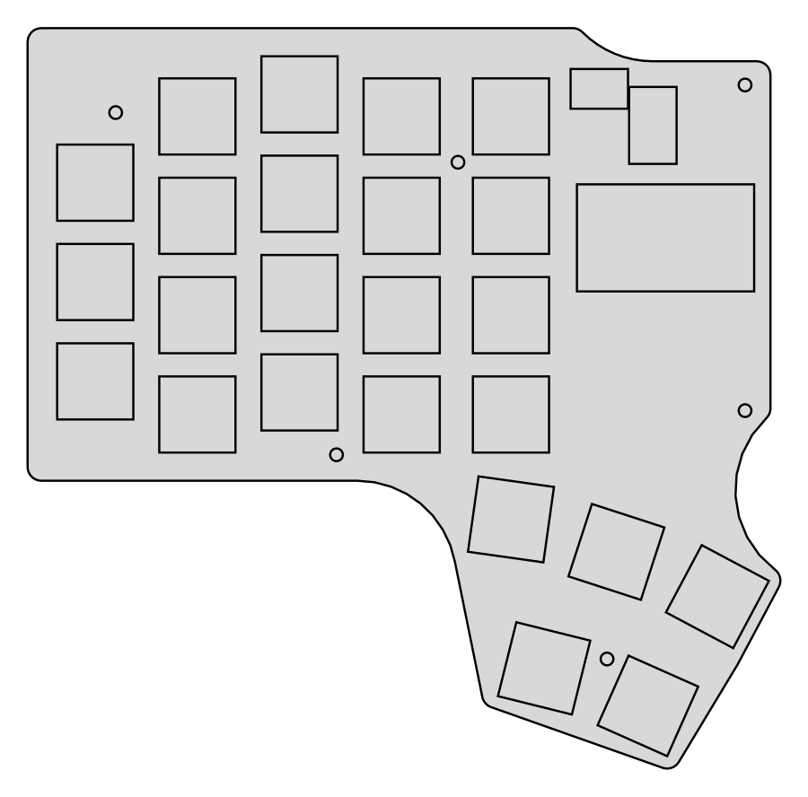

# pinkyless48

A 48-key column-staggered split keyboard, designed around barely using your
pinkies. Kailh Choc v1 low-profile, hotswap, wired, RP2040 + QMK.



## The layout

24 keys per half:

```
 pinky  ring   mid   idx  inner
   O      O     O     O     O                  number row
   O      O     O     O     O                  top row
   O      O     O     O     O                  home row
   ·      O     O     O     O                  bottom row

                            O     O     O      thumb arc
                               O     O         thumb island
```

The thumb cluster starts where the finger matrix ends: the nearest thumb key
sits directly below the innermost finger column, and the cluster runs inboard
from there rather than being tucked back underneath the fingers.

The pinky drops only the **bottom row**, the position it reaches worst. It
keeps number, top and home. Because the number row therefore has all five
columns, it carries a full `1234567890` across the two halves and digits need
no layer. Z, Shift, Ctrl, Tab, Esc, Enter and Backspace — the rest of what a
pinky normally carries — moved to the thumbs and to home-row mods.

Five thumb keys per half, in two groups: a 3-key arc that follows the thumb's
natural sweep inboard and down, and a 2-key island tucked below it for the
keys you press less often. The furthest is 42 mm from the thumb home key,
inside the ~45 mm a relaxed thumb can sweep without the hand leaving position.

Column stagger is deliberately flat: inner, index and ring all sit level with
each other, middle is 4 mm further forward, and pinky drops **12 mm** back.
This is not the usual finger-length stagger — only the middle finger gets
extra reach.

The pinky drop is larger than it looks like it needs to be, on purpose. That
column carries three keys and skips the *bottom* row, so its block occupies
the upper three row positions. With a small stagger the column reads as
sitting higher than its neighbours even though every individual key is lower;
12 mm brings the whole block down to where a short finger actually rests.

One consequence worth knowing: the reversible Choc hotswap footprint carries
socket pads for *both* faces of the board and is ±9.58 mm wide, so two columns
at the *same* height short against each other at an 18 mm pitch. Index and
inner are level, so that single gap is opened to **19.8 mm**. Every other gap
stays at 18 mm, clearing on vertical offset alone.

Key pitch is **18.5 × 18 mm**, slightly looser than the 18 × 17 Choc standard.
Stock spacing leaves only 0.5 mm between MBK keycaps and 2.0 mm between switch
flanges, which works but is tight for getting a puller in and leaves nothing
for caps larger than MBK. This gives 1.0 mm between caps, 1.5 mm down rows and
3.0 mm between flanges, for ~2 mm of width and ~3 mm of height.

Board: **141 × 138 mm** per half. Case: **8.9 mm** tall before switches.
The width comes from the thumb cluster reaching ~37 mm inboard of the matrix.

The controller, TRRS jack and reset button live in the **notch** between the
finger matrix and the thumb cluster, not on a strip above the matrix. Because
the thumb cluster runs inboard and down, that area is dead space already
inside the bounding box, so the controller costs nothing in overall size —
putting it above the matrix instead added 30 mm of board height for a part
that is 33 × 18 mm. The USB port faces inboard, so the cable exits between
the halves.

The board silhouette is built from **three simple shapes**, not from one
rectangle per key: the finger matrix as a single rectangle, the thumb cluster
as a hull over its five keys, and the controller area as a rectangle. Unioning
24 key pads plus a rotated thumb cluster used to produce an outline of ~50
entities full of little scallops and fillets, which is miserable to build a
case against. The result now is **9 straight lines and 12 arcs**, for about
1 cm² more copper.

The union is then **morphologically closed** (grown 18 mm, shrunk 18 mm) before
filleting. That fills the concave pockets between the thumb cluster, the
controller area and the key pads — dead space whose sharp inside corners are
crack initiation points in both FR4 and the printed plate. It costs 1.3% more
board area and nothing in bounding box, and keeps the narrowest neck above 50 mm. Each half is closed separately —
closing them together would bridge the gap between the halves and fuse them. A plain convex hull would have swallowed the whole empty
region left of the thumb cluster and added ~40 cm² of pointless board.

## What is in here

```
src/config.yaml        the single source of truth - layout, nets, footprints
src/check_*.py         five verification passes, run by `make check`
src/find_mounts.py     searches the board for valid screw positions
case/gen_case.py       plate + tray STLs, generated from the same key positions
firmware/gen_qmk.py    generates keyboard.json from the same key positions
firmware/pinkyless48/  QMK keymap
build/                 generated outputs (committed - they are the deliverable)
docs/ORDERING.md       how to get it made with almost no soldering
docs/PIN_MAPPING.md    controller pins, matrix cells, debugging a bad matrix
```

Everything downstream — PCB, case, firmware — is derived from `src/config.yaml`.
Change a dimension there, run `make`, and the board, the STLs and the keymap
all follow. Nothing is hand-maintained in two places.

## Build it

```sh
make deps      # npm install + python deps
make           # build, check, case, firmware
```

`make check` runs five passes and fails loudly:

| Check | Catches |
|-------|---------|
| `layout` | **minimum** keycap and switch-flange gaps (not just overlap), for two cap sizes; thumb keys out of reach |
| `outline` | disconnected pieces; stray voids; missing screw holes; **thin necks and concave notches** |
| `matrix` | miswired switch/diode; **two keys sharing a matrix cell** |
| `fit` | components or screws hanging off the board edge |
| `shorts` | **pads on different nets overlapping**; copper clearance |

These are not decoration. Building this design they caught, among others: the
thumb cluster coming out as four disconnected board fragments; seven short
circuits where the controller and TRRS jack overlapped the number-row
switches; and the socket-pad short between the two level columns that forced
the 19.8 mm inner pitch. Every one would have produced a dead board at full
cost.

## Before you order boards

**The PCB is placed and netlisted but not routed.** Ergogen does not route
traces. Open the board in KiCad, route the matrix, pour ground, run DRC, and
plot gerbers. Full instructions in [docs/ORDERING.md](docs/ORDERING.md) —
please read it before spending money.

## Printing the case

Four STLs in `build/case/`: `plate_left`, `plate_right`, `tray_left`,
`tray_right`. All watertight, all flat-bottomed, no supports needed.

- **Plate** — 1.3 mm, prints on its back. Choc switches clip into the 13.8 mm
  cutouts. Print in PETG or ABS if you can; 1.3 mm of PLA is a little brittle
  around the cutouts.
- **Tray** — 0.2 mm layers, 3 perimeters, 20 % infill.

Stack, from the tray floor: 2 mm floor, 4 mm gap for the hotswap sockets,
1.6 mm PCB, 1.3 mm plate. Six M2 × 6 mm self-tapping screws go down through
the plate and PCB into the printed bosses.

The controller and TRRS jack sit *above* the plate, through the opening in the
notch beside the thumb cluster — the controller is socketed on headers, so it
stands proud. That is normal for a DIY split and keeps the USB port and jack
accessible without any wall cutouts.

## Adjusting it

The pinky rows, thumb positions and column stagger are all named values at the
top of `src/config.yaml`. Three things worth knowing before you edit:

- Ergogen's `stagger` is **cumulative**, not absolute. The config works around
  this by writing each column as `st_this - st_previous`, so you can edit the
  absolute numbers and the deltas take care of themselves.
- The thumb cluster is anchored to `matrix_inner_bottom` with t1 at an
  x-shift of exactly 0, so the nearest thumb key stays aligned with the last
  finger column and the cluster always begins where the matrix ends. Add or
  remove a finger column and the cluster follows. To slide the whole cluster,
  change that one x-shift rather than editing all five.
- After moving anything, run `make mounts` to re-derive screw positions and
  paste the result back into the `mounts` zone. Screw positions depend on the
  layout, and a screw that lands in a switch cutout leaves that switch with
  nothing to clip into.

Then `make check`. Do not order boards from a red tree.
